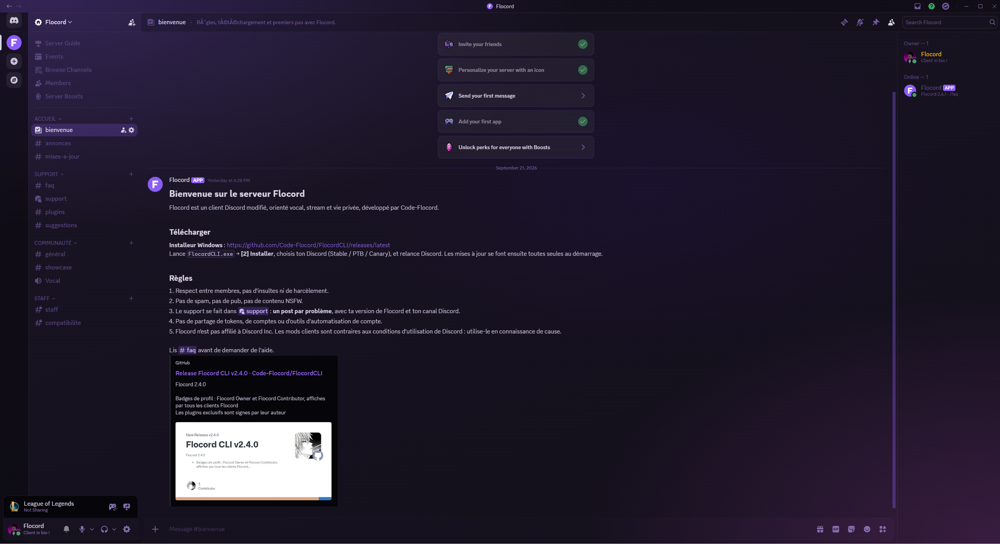
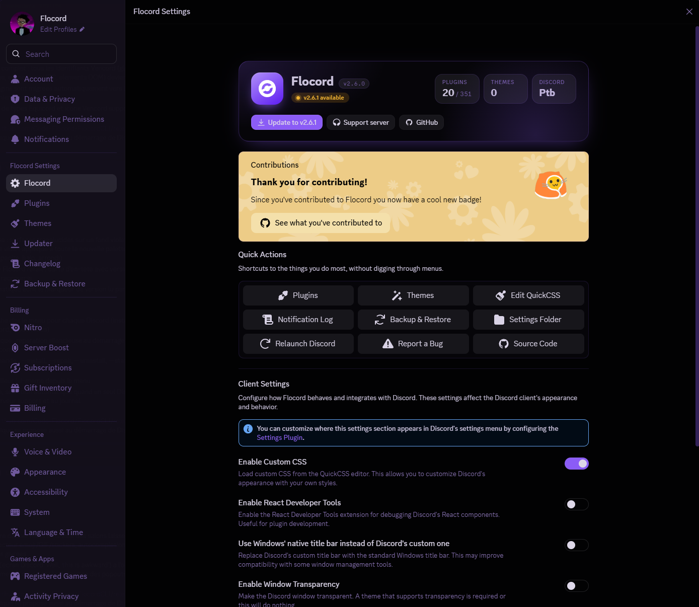
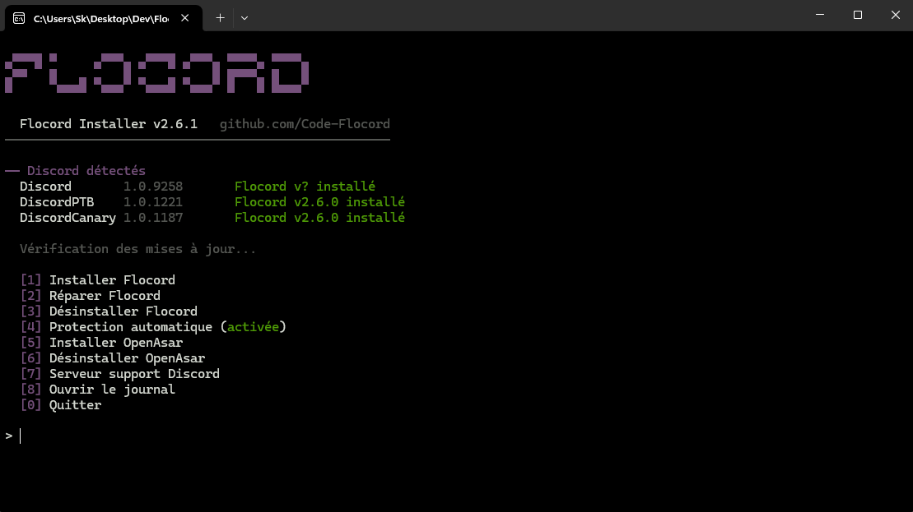

<p align="center">
  
</p>

<h1 align="center">Flocord</h1>

<p align="center">
  Un client Discord modifié, indépendant, avec son propre thème, son propre installeur et plus de 350 plugins.
</p>

<p align="center">
  <a href="https://github.com/Code-Flocord/FlocordCLI/releases/latest"></a>
  <a href="https://github.com/Code-Flocord/FlocordCLI/releases"></a>
  <a href="https://discord.gg/CH45T3PH5r"></a>
  <a href="LICENSE"></a>
</p>

<p align="center">
  <a href="https://github.com/Code-Flocord/FlocordCLI/releases/latest/download/FlocordCLI.exe"><b>⬇ Télécharger l'installeur (Windows)</b></a>
  &nbsp;·&nbsp;
  <a href="https://discord.gg/CH45T3PH5r">Serveur support</a>
  &nbsp;·&nbsp;
  <a href="#plugins-exclusifs">Plugins exclusifs</a>
</p>

---

## Aperçu

<p align="center">
  
</p>

<table>
  <tr>
    <td width="50%"></td>
    <td width="50%"></td>
  </tr>
  <tr>
    <td align="center"><sub>Paramètres → Flocord : version, état de mise à jour, raccourcis</sub></td>
    <td align="center"><sub>L'installeur : état de chaque Discord, réparation, protection automatique</sub></td>
  </tr>
</table>

## Pourquoi Flocord

- **Thème Glass intégré** — fond violet profond, surfaces translucides, popouts et menus givrés. Couleurs, opacité, halo et arrondi réglables en direct, ou style *Flat* pour un rendu sobre.
- **Plus de 350 plugins** — la base Vencord, une sélection héritée d'Equicord, et une couche de plugins exclusifs orientés vocal, stream et vie privée.
- **Mises à jour automatiques** — Flocord se met à jour depuis Discord au démarrage ; l'installeur se met à jour lui-même.
- **Protection automatique** — quand Discord se met à jour et efface le mod, Flocord est réinstallé tout seul au démarrage de Windows.
- **Indépendant** — aucun serveur tiers, aucune dépendance à un projet amont : le code, l'infrastructure et les mises à jour sont gérés ici.

## Installation

1. Télécharge [`FlocordCLI.exe`](https://github.com/Code-Flocord/FlocordCLI/releases/latest/download/FlocordCLI.exe) et lance-le.
2. L'installeur affiche chaque Discord trouvé (Stable, PTB, Canary) et l'état de Flocord dessus.
3. Choisis **[1] Installer** — Discord est fermé, patché puis relancé.
4. Recommandé : active **[4] Protection automatique** pour ne plus jamais avoir à réparer à la main.

> **Windows SmartScreen** peut afficher un avertissement la première fois : *Informations complémentaires → Exécuter quand même*. L'installeur n'est pas signé (certificat payant), son code est [public](https://github.com/Code-Flocord/FlocordCLI).

### Discord s'est mis à jour et Flocord a disparu ?

Relance `FlocordCLI.exe` → **[2] Réparer**. Avec la protection automatique activée, ça se fait tout seul au prochain démarrage de Windows.

### Ligne de commande

```
FlocordCLI.exe --install | --repair | --uninstall | --status
               [--channel stable|ptb|canary] [--silent]
               --enable-protection | --disable-protection
```

### Désinstaller

`FlocordCLI.exe` → **[3] Désinstaller** : le Discord d'origine est restauré à l'identique.

## Plugins exclusifs

Dans **Paramètres → Flocord → Plugins**, le filtre **Show Flocord Exclusives** liste les plugins propres à Flocord. Quelques-uns :

| Domaine | Plugins |
|---|---|
| Audio & vocal | STEREO, RipCordStereoFixed, StereoScreenshareAudio, AntiStereo, BetterMicrophone, ChannelVolume, NormaliserVolume, AudioLimiter, LightcordBitrate |
| Stream & vie privée | StreamBlurPrivacy, StreamProof, NoDMWhileStreaming, CustomStreamTopQ, FakeDeafen, InvisibleAsDnd |
| Automatisations | AutoUnmute, AFK, AutoAFK, AutoDeleter, MessageCleaner |
| Protections | AntiGroup, AntiMove, AntiNickname, AntiDisconnect, DoubleClickAntiLog |
| Groupes & DMs | GroupKicker, LockGroup, CloseAllDms, LeaveAllGroups |
| Apparence | FlocordTheme, FlocordToolbox |
| Divers | ChatGPT, GpuBinder |

## Support

- **Serveur Discord** : https://discord.gg/CH45T3PH5r — forum `#support`, FAQ, annonces de versions.
- **Bug** : [ouvrir un ticket](https://github.com/Code-Flocord/Flocord/issues/new), ou le bouton *Report a Bug* dans Paramètres → Flocord.
- Journal de l'installeur : `Bureau\Flocord Logs\installer.log`.

## Build depuis les sources

Prérequis : [Git](https://git-scm.com/), [Node.js](https://nodejs.org/) ≥ 22, [pnpm](https://pnpm.io/) (`npm i -g pnpm`), [Rust](https://rustup.rs/) pour l'installeur.

```bash
# Le mod
git clone https://github.com/Code-Flocord/Flocord
cd Flocord
pnpm install --frozen-lockfile
pnpm buildStandalone          # → dist/desktop.asar

# L'installeur (embarque l'asar)
git clone https://github.com/Code-Flocord/FlocordCLI
cd FlocordCLI
copy ..\Flocord\dist\desktop.asar assets\desktop.asar
cargo build --release         # → target/release/FlocordCLI.exe
```

## Crédits

Flocord est né d'un fork d'[Equicord](https://github.com/Equicord/Equicord), lui-même dérivé de [Vencord](https://github.com/Vendicated/Vencord) par [Vendicated](https://github.com/Vendicated). Le projet est aujourd'hui développé indépendamment par [Code-Flocord](https://github.com/Code-Flocord). Le code hérité conserve ses en-têtes de licence, conformément à la GPL-3.0.

## Avertissement légal

Discord est une marque déposée de Discord Inc. Flocord n'est pas affilié à Discord Inc.

<details>
<summary>Utiliser un client modifié enfreint les conditions d'utilisation de Discord</summary>

Les modifications de client sont contraires aux Conditions d'Utilisation de Discord. Discord y est généralement indifférent et aucun cas de bannissement connu n'existe pour la simple utilisation d'un mod client, mais reste prudent : n'utilise pas de plugins au comportement abusif, et si ton compte t'est précieux, utilise Flocord à tes propres risques.

</details>
